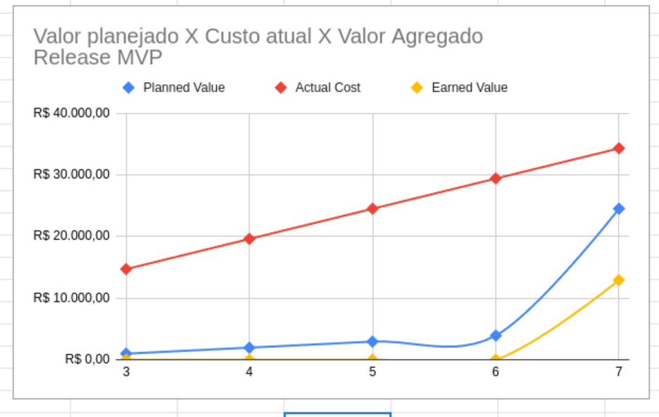
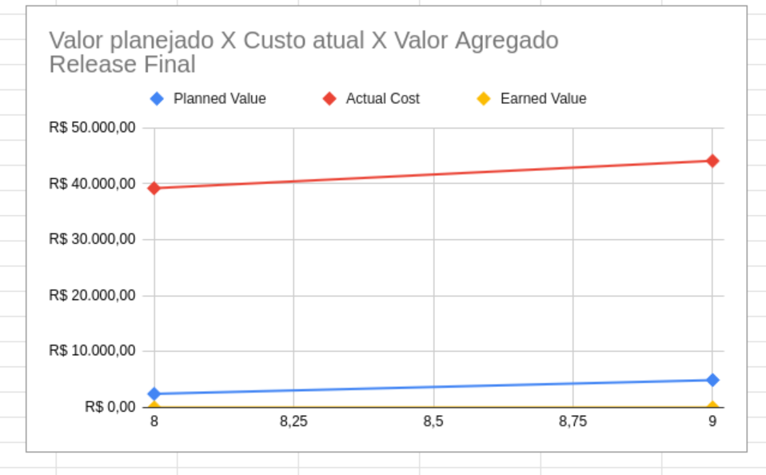

# EVM (Earned Value Management)

O **EVM (Earned Value Management)**, ou Gerenciamento do Valor Agregado, é uma metodologia amplamente utilizada em gerenciamento de projetos para medir o desempenho e o progresso de um projeto de forma objetiva. Ele integra escopo, cronograma e custos, permitindo que os gerentes de projeto avaliem se o projeto está dentro do prazo, do orçamento e se está entregando o valor esperado.

O EVM utiliza três métricas principais para avaliar o desempenho do projeto:

1. **PV (Planned Value) - Valor Planejado**:  
   Representa o valor do trabalho que deveria ter sido concluído até um determinado ponto no tempo, de acordo com o plano do projeto. É o custo orçado para o trabalho planejado.

   \[
   PV = \% \text{ do trabalho planejado} \times \text{Orçamento Total (BAC)}
   \]

2. **EV (Earned Value) - Valor Agregado**:  
   Representa o valor do trabalho que foi realmente concluído até o momento. É o custo orçado para o trabalho realizado.

   \[
   EV = \% \text{ do trabalho realizado} \times \text{Orçamento Total (BAC)}
   \]

3. **AC (Actual Cost) - Custo Real**:  
   Representa os custos reais incorridos para realizar o trabalho até o momento. É o valor gasto para concluir o trabalho realizado.

   \[
   AC = \text{Custos reais incorridos}
   \]

---

## Fórmulas do EVM

### 1. Variações de Desempenho

- **CV (Cost Variance) - Variação de Custo**:  
  Mostra se o projeto está acima ou abaixo do orçamento.  
  \[
  CV = EV - AC
  \]
  - Se \( CV > 0 \): Projeto abaixo do orçamento (bom).  
  - Se \( CV < 0 \): Projeto acima do orçamento (ruim).

- **SV (Schedule Variance) - Variação de Prazo**:  
  Mostra se o projeto está adiantado ou atrasado em relação ao cronograma.  
  \[
  SV = EV - PV
  \]
  - Se \( SV > 0 \): Projeto adiantado (bom).  
  - Se \( SV < 0 \): Projeto atrasado (ruim).

---

### 2. Índices de Desempenho

- **CPI (Cost Performance Index) - Índice de Desempenho de Custo**:  
  Mede a eficiência do uso dos recursos.  
  \[
  CPI = \frac{EV}{AC}
  \]
  - Se \( CPI > 1 \): Custo menor que o planejado (bom).  
  - Se \( CPI < 1 \): Custo maior que o planejado (ruim).

- **SPI (Schedule Performance Index) - Índice de Desempenho de Prazo**:  
  Mede a eficiência do tempo em relação ao cronograma.  
  \[
  SPI = \frac{EV}{PV}
  \]
  - Se \( SPI > 1 \): Projeto adiantado (bom).  
  - Se \( SPI < 1 \): Projeto atrasado (ruim).

---

### 3. Previsões Futuras

- **ETC (Estimate to Complete) - Estimativa para Concluir**:  
  Estimativa dos custos necessários para concluir o trabalho restante.  
  \[
  ETC = \frac{BAC - EV}{CPI} \quad \text{(considerando o desempenho atual)}
  \]

- **EAC (Estimate at Completion) - Estimativa no Término**:  
  Estimativa do custo total do projeto ao final, com base no desempenho atual.  
  \[
  EAC = AC + ETC
  \]
  Ou, se o desempenho futuro for igual ao planejado:  
  \[
  EAC = AC + (BAC - EV)
  \]

- **VAC (Variance at Completion) - Variação no Término**:  
  Diferença entre o orçamento total (BAC) e a estimativa no término (EAC).  
  \[
  VAC = BAC - EAC
  \]
  - Se \( VAC > 0 \): Projeto abaixo do orçamento (bom).  
  - Se \( VAC < 0 \): Projeto acima do orçamento (ruim).

- **TCPI (To Complete Performance Index) - Índice de Desempenho para Concluir**:  
  Mede a eficiência necessária para concluir o projeto dentro do orçamento restante.  
  \[
  TCPI = \frac{BAC - EV}{BAC - AC}
  \]
  - Se \( TCPI > 1 \): É necessário melhorar o desempenho.  
  - Se \( TCPI < 1 \): O desempenho atual é suficiente.

---

Caso exista maior interesse sobre a metodologia Agile EVM, o material referente à ela pode ser encontrado no seguinte artigo: [AgileEVM – Earned Value Management in Scrum ProjectsTexto do link](https://www.projectmanagement.com/content/attachments/itstratpm_080812105311.pdf).
# EVM - Sentinela

O processo de monitoramento do projeto se iniciou durante a release 1. Com os custos do projeto já relatados no documento de Custos.

<iframe width="800" height="300" src="https://docs.google.com/spreadsheets/d/1YwVDR6rTVSiXeyPFe3dFgfc3uppEwnWIbtUq1g6CdAI/edit?gid=518402925#gid=518402925"></iframe>

# Análise das Major Releases

Com base nos gráficos gerados por sprint, que comparam o Valor Agregado X Custo Atual X Valor Planejado, é possível avaliar o desempenho de cada major release entregue pela equipe.  

### Análise da Release 1

A **Release 1** teve um ciclo de desenvolvimento de duas semanas, com um planejamento que previa a entrega de aproximadamente 25% do valor agregado total do sistema. No entanto, devido a desafios iniciais enfrentados pela equipe no processo de válidação, o valor efetivamente entregue e aceito ficou abaixo da meta estabelecida.

### Análise da Release MVP

A análise da Release MVP, representada pelo gráfico "Valor Planejado x Custo Atual x Valor Agregado", revelou importantes insights sobre o desempenho da equipe durante as sprints.

#### Desempenho Observado:
1. **Custo Atual (Actual Cost)**: O custo real do projeto apresentou um crescimento contínuo e significativo, ultrapassando o valor planejado em todas as sprints. Isso indica que o esforço necessário para executar as atividades foi maior do que o previsto inicialmente.
   
2. **Valor Planejado (Planned Value)**: O planejamento previa um aumento gradual nas entregas ao longo do período, com expectativas alinhadas ao progresso natural do desenvolvimento.
   
3. **Valor Agregado (Earned Value)**: O valor efetivamente entregue e aceito ficou abaixo do planejado. Isso evidencia que as metas estabelecidas para cada sprint não foram completamente atingidas.

#### Conclusões:
- O custo elevado, combinado com entregas abaixo do esperado, aponta para ineficiências no processo de desenvolvimento e gestão de recursos.
- O recesso combinado com o atrazo dos testes feitas pelo POs e dificuldades iniciais da equipe podem ter contribuído para atrasos e menor produtividade, afetando diretamente o valor agregado.
- Ajustes no planejamento e na execução das tarefas foram necessários para evitar novos desvios no cronograma e no orçamento.

Este diagnóstico reforça a necessidade de otimizar os processos e aprimorar o alinhamento entre os recursos disponíveis e os objetivos definidos para as próximas releases.

### Análise da Release Final

O gráfico "Valor Planejado x Custo Atual x Valor Agregado" da Release Final apresenta os resultados obtidos ao final do projeto, destacando a relação entre o planejamento, os custos e as entregas realizadas.

#### Desempenho Observado:
1. **Custo Atual (Actual Cost)**: O custo real manteve-se elevado e estável em torno de R$ 40.000,00, representando um investimento significativo para a conclusão da release.
   
2. **Valor Planejado (Planned Value)**: O planejamento previa uma entrega incremental, mas em níveis baixos, com o valor planejado ficando consideravelmente abaixo do custo real.
   
3. **Valor Agregado (Earned Value)**: O valor efetivamente entregue ao final do projeto foi insignificante em relação ao valor planejado e ao custo real, indicando que os objetivos principais da release final não foram atingidos.

#### Conclusões:
- **Baixa eficiência**: Apesar do alto investimento financeiro, o valor agregado entregue foi praticamente inexistente, o que indica falhas significativas no gerenciamento e execução das atividades.
- **Desalinhamento com o planejamento**: O baixo valor planejado sugere expectativas conservadoras, mas, ainda assim, as entregas ficaram muito abaixo das metas estabelecidas.
- **Impacto negativo no projeto**: O desempenho da Release Final comprometeu a relação custo-benefício do projeto, sugerindo que os recursos foram mal alocados ou que imprevistos críticos impediram as entregas.

Essa análise reforça a importância de revisar processos e estratégias para garantir que as próximas iniciativas entreguem valor compatível com os recursos investidos.

### **Histórico de Versões**

| **Versão** | **Nome da Versão**      | **Data**      | **Responsável**         | **Descrição/Alterações**                                 |
|------------|-------------------------|---------------|-------------------------|----------------------------------------------------------|
|   1.0      | Criação do documento    | 09/02/2025    | Daniela Soares        | Criação do documento                                     |

## Referências

 [AgileEVM – Earned Value Management in Scrum ProjectsTexto do link](https://www.projectmanagement.com/content/attachments/itstratpm_080812105311.pdf)