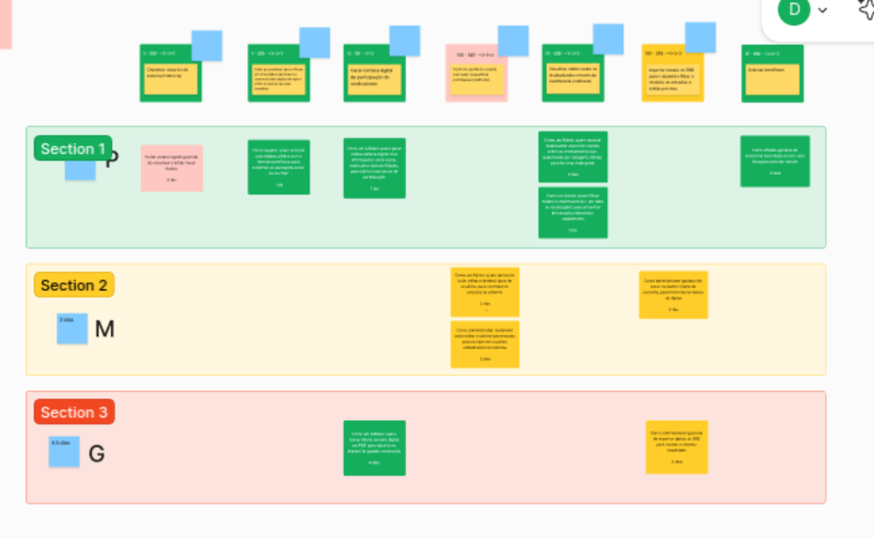

# Backlog Inicial
O backlog do produto foi definido a partir do sequenciador instanciado durante o Lean Inception. Como pode ser visto abaixo: 

Com o sequenciador em mãos, o time se reuniu e começou a detalhar todas as funcionalidades a nível de Histórias de Usuários, que viriam a compor o Backlog do Produto. Na imagem abaixo é possível ver que as histórias foram instanciadas a partir das funcionalidades do MVP.

A tabela abaixo apresenta as histórias de usuário relacionadas à gestão de dados, importação de extratos financeiros, solicitação de benefícios e gestão de patrimônio, com seus respectivos pontos de complexidade.

| **Categoria**                          | **História de Usuário**                                                                                             | **Pontos** |
| -------------------------------------- | ------------------------------------------------------------------------------------------------------------------- | ---------- |
| **Visualizar dados sobre os sindicalizados através de dashboards (melhoria)** | Como um Admin, quero acessar dashboards com informações sobre os sindicalizados (ex.: quantidade por categoria, idade), para ter uma visão geral. | 21         |
|                                        | Como um Admin, quero filtrar dados no dashboard (ex.: por data ou localização), para encontrar informações relevantes rapidamente. | 8          |
| **Importar extrato do BRB para o sistema e filtrar o relatório de entradas e saídas por mês** | Como administrador gostaria de tratar os dados vindos da consulta, para inseri-los no banco de dados.          | 21         |
|                                        | Como administrador gostaria de importar dados do BRB para manter o sistema atualizado.                        | 21         |
|                                        | Como administrador gostaria de gerar um relatório com base nos dados importados do BRB.                       | 21         |
| **Solicitar benefícios**               |Como afiliado gostaria de selecionar benefícios dentre uma lista para solicitar vínculo.                     | 5          |
|                                        | Como administrador, gostaria de ter acesso a todos os benefícios cadastrados e avaliar cada pedido.          | 3          |
| **Importar arquivo retorno do BRB**    | Como administrador, gostaria de tratar o arquivo retorno do BRB, para importá-lo em nosso banco de dados.     | 21         |
|                                        | Como administrador, gostaria de importar o arquivo de retorno tratado no Banco de dados.                     | 8          |
|                                        | Como administrador, gostaria de um relatório com base nesses arquivos retornos.                              | 21         |
| **Gerir patrimônio**                   | Como administrador, gostaria de cadastrar, visualizar, editar e deletar os patrimônios.                      | 8          |
|                                        | Como administrador, gostaria que houvesse uma área específica do site para gerir os patrimônios cadastrados.  | 5          |
|                                        | Como administrador, gostaria de gerar um relatório com todos os patrimônios cadastrados.                     | 8          |

## Histórico de Versões

| Alteração                                                                    | Data     | Autor       |
| ---------------------------------------------------------------------------- | -------- | ----------- |
| Criação do documento                                                         | 08/12/2024 | Daniela Soares |

